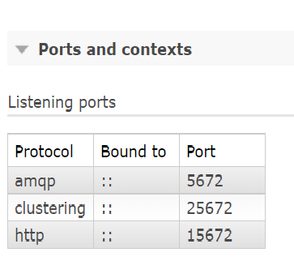
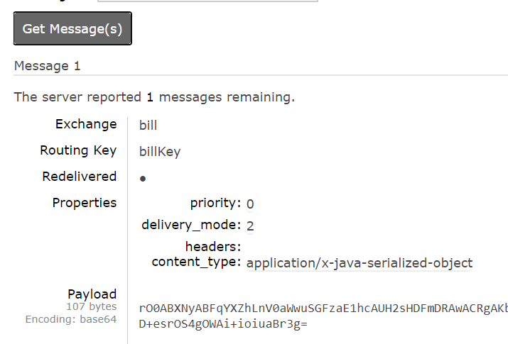

# AMQP-RabbitMQ

## JMS =>ActiveMQ & AMQP =>RabbitMQ

```
		JMS		  AMQP 
定義	  java api   網路協定
跨平台	 X		   O

```
spring 都可用

```
spring-boot-starter-activemq (ActiveMQ)
spring-boot-starter-artemis  (ActiveMQ)
spring-boot-starter-amqp 	 (RabbitMQ)

@JmsListener       <=>    @EnableJms    =>JmsAutoConfiguration
@RabbitListener    <=>    @EnableRabbit  =>RabbitAutoConfiguration

```
Message  Publisher   Exchange(direct，fanout，topic，headers)

Queue: 訊息對列
Binding: exchange與queue 間的綁定關係
Connection: 網路連接(類似一條通道)
Channel: 頻道，一條TCP中多個channel可連接，節省資源用，不用很多條connection

```

message傳遞

Publisher => Broker		   [Channel,Channel,Channel]  => Consumer
			   |				      |
		  Virtual Host		      Connection  
			   |				      |
			(Exchange) - Binding - (Queue)


direct: 點對點(一對一)  => roter-key mapping到才有
fanout: 一對多 (廣播) =>全部都收到
topic:
		.# =>0~多個
		.* =>對應1個

```


```
RabbitMQ=> 
docker pull "有management的(有管理介面) (:3-management)" 
docker run -d -p 5672:5672 -p 15672:15672 --name "名字"  "imageID"

docker-machine ip default => get docker tool box ip

docker inspect "ID 或名稱"  | grep '"IPAddress"' | head -n 1

go rabbitmq ui => ipAddress:15672

```

### 自動配置

1. RabbitAutoConfiguration
2. ConnectionFactory
3. RabbitProperties 設置RabbitMQ config

```properties
spring.rabbitmq.host="ip"
spring.rabbitmq.username="帳"
spring.rabbitmq.password="密"
spring.rabbitmq.port="預設5672"
spring.rabbitmq.virtual-host=預設 " / "

```

### 參考RabbitMQ UI




4.&nbsp;RabbitTemplate :讓RabbitMQ發送和接收訊息<br>
5.&nbsp;AmqpAdmin :RabbitMQ系統管組件

### 發送
```java

	rabbitTemplate.send(exchange,routeKey,message);
		
		//傳入send對象，自動序列化發送給rabbitmq
	rabbitTemplate.convertAndSend(exchange, routingKey, object);
```
### RabbitMQ 內 ，payLoad是序列化後的結果



### 接收

```java

rabbitTemplate.receiveAndConvert("billQueue");

```

### 接收序列化=>(自訂config)


### 實作
1. 開啟=> @EnableRabbit
2. 監聽=> @RabbitListener(queues="Rabbit上的queue")


## AmqpAdmin: 負責新增，刪除Queue、Exchange、Binding


